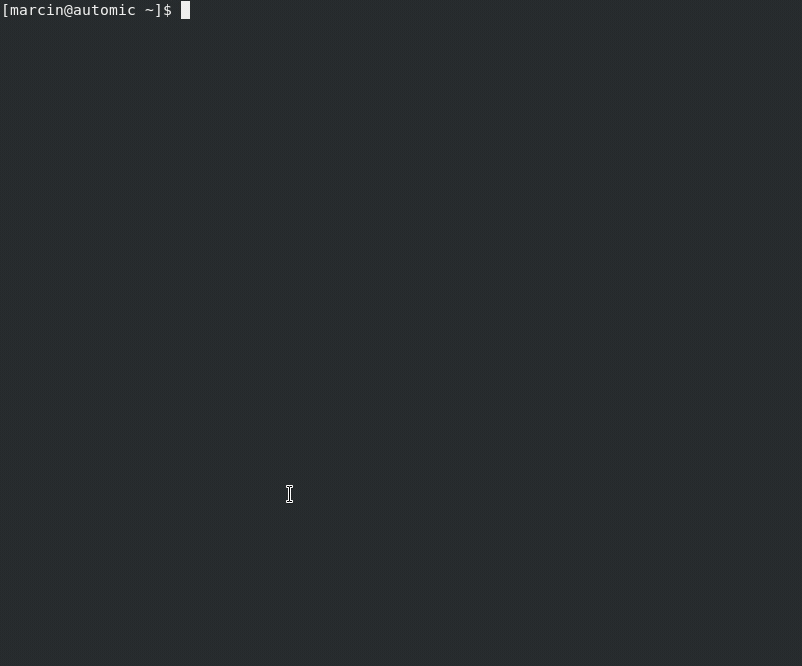
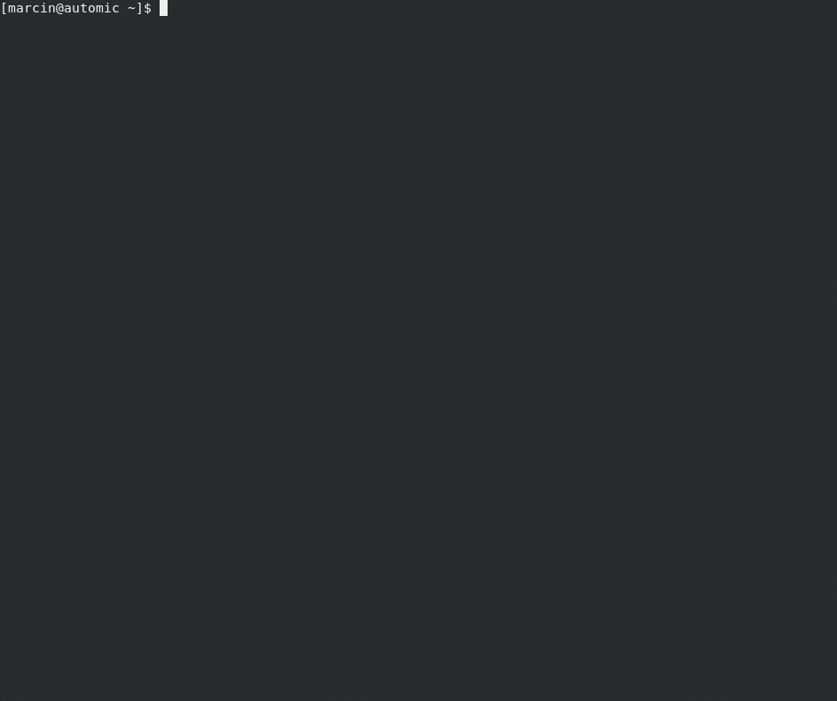

# Python Automic ServiceManagerDialog

A CLI GUI wrapper for the Automic [ucybsmcl](https://docs.automic.com/documentation/webhelp/english/AA/21.0/DOCU/21.0/Automic%20Automation%20Guides/Content/ServiceManager/ServiceManager_CLI.htm)


```
Host: localhost:8871			Phrase:  Automic
                                       Current time: 26-02-2022 22:40:43
------------------------------------------------------------------------
|  # |              Process Name |   |        PID |          Timestamp | 
------------------------------------------------------------------------
|  1 | AUTOMIC-DATABASE          | R |      70771 | 2022-02-25 - 11:51 | 
|  2 | WP1                       | R |     126410 | 2022-02-25 - 23:12 | 
|  3 | CP1                       | R |     126431 | 2022-02-25 - 23:13 | 
|  4 | CP2                       | R |     126451 | 2022-02-25 - 23:13 | 
|  5 | JWP                       | R |     126474 | 2022-02-25 - 23:13 | 
|  6 | JCP                       | R |     126527 | 2022-02-25 - 23:13 | 
|  7 | REST                      | R |     126586 | 2022-02-25 - 23:13 | 
|  8 | AWI                       | R |      70976 | 2022-02-25 - 11:51 | 
|  9 | WP2                       | R |     126760 | 2022-02-25 - 23:14 | 
| 10 | WP3                       | R |     139030 | 2022-02-26 - 22:12 | 
| 11 | WP4                       | S |            |                    | 
| 12 | WP5                       | S |            |                    | 
| 13 | DATABASE-AGENT01          | S |            |                    | 
| 14 | DATABASE-SERVICE01        | S |            |                    | 
| 15 | UNIX01                    | S |            |                    | 
| 16 | WEBSERVICESOAP01          | R |      71148 | 2022-02-25 - 11:52 | 
| 17 | JMS01                     | R |      71147 | 2022-02-25 - 11:52 | 
| 18 | FTPAGENT01                | R |     127583 | 2022-02-25 - 23:17 | 
| 19 | WEBSERVICEREST01          | R |      71240 | 2022-02-25 - 11:52 | 
| 20 | RULE-ENGINE               | R |      71332 | 2022-02-25 - 11:52 | 
| 21 | ANALYTICS-BACKEND         | R |      72132 | 2022-02-25 - 11:52 | 
| 22 | STREAMING-PLATFORM        | R |      72214 | 2022-02-25 - 11:52 | 

Actions: R - restart, S - start, K - stop
         KA - stop abnormally , KS - shutdown 
         Q - quit, RE - refresh
| R
```


## Description

This is an attempt to make the interaction with ServiceManager on Unix / commandline based interfaces less painful.

## Getting Started

### Dependencies

* Python3 with standard libraries, no external dependecies used
* Any version of ucybsmcl

### Installing

* git clone / download

### Supported actions

* Stoping service
* Starting service
* Restarting service
* Shutdown Automic System
* Stop abnormally

### Usage

The script can be started in two modes

#### With configuration file as parameter

In this mode the script will process the data in the configuration file provided and let you choose which system you want to configure. 

The format of the configuration file is following:

```
{ "connections": [
  {
    "name": "Test_V12.3",
    "host": "localhost",
    "port": "8872",
    "phrase": "Automic1",
    "pass": false,
    "smgrclPath": "/app/Automic_12.3/Automation.Platform/ServiceManager/bin/ucybsmcl"
    },
{
    "name": "Test_V21",
    "host": "localhost",
    "port": "8871",
    "phrase": "Automic",
    "pass": false,
    "smgrclPath": "/app/Automic/Automation.Platform/ServiceManager/bin/ucybsmcl"
}
]}
```
You can define as many connections as you like

**Demo:**




If there is only one connection defined in the config file you will not get prompted of course. 


#### Without configuration - interactive mode

In this mode the script will ask you ( of use env variables ) to establish the connection to ServiceManager

Demo providing all the data interactively:




Demo reading most of the necessary data from the env variables:


## Authors

Marcin Uracz 

## Version History

* 1.0
    * Initial Release
